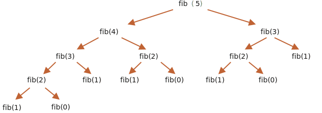

Solusi pertama kita harus coba adalah rekursi.

Angka fibonacci adalah rekursi dari definisinya:

```js run
function fib(n) {
  return n <= 1 ? n : fib(n - 1) + fib(n - 2);
}

alert( fib(3) ); // 2
alert( fib(7) ); // 13
// fib(77); // akan sangat lambat!
```

...Tapi untuk nilai besar dari `n` akanlah sangat lambat. Contoh, `fib(77)` mungkin akan memberatkan mesinnya dan untuk beberapa saat akan menggunakan seluruh sumberdaya CPU.

Itu karena fungsinya memanggil terlalu banyak pemanggilan. Nilai yang sama akan terus di evaluasi lagi dan lagi.

Contoh, kita lihat satu potongan dari kalkulasi untuk `fib(5)`:

```js no-beautify
...
fib(5) = fib(4) + fib(3)
fib(4) = fib(3) + fib(2)
...
```

Disini kita bisa melihat nilai dari `fib(3)` dibutuhkan untuk `fib(5)` dan `fib(4)`. Jadi `fib(3)` akan dipanggil dan dievaluasi dua kali secara bergantian.

Ini adalah pohon rekursi penuh:



Kita dengan jelas bisa memperhatikan bahwa `fib(3)` dievaluasi dua kali dan `fib(2)` di evaluasi tiga kali. Total dari komputasi akan terus membesar secara cepat lebih dari `n`, membuatnya besar sekali bahkan untuk `n=77`.

Kita bisa mengoptimasinya dengan mengingat nilai yang telah dievaluasi: jika sebuah nilai katakan `fib(3)` dikalkulasi sekali, lalu kita bisa menggunakan nilainya lagi di komputasi selanjutnya.

Varian lainnya haruslah menyerah dengan rekursi dan menggunakan algoritma lain yang benar-benar berbeda.

Daripada memulai dari `n` ke nilai yang dibawahnya, kota bisa membuat perulangan dimulai dari `1` dan `2`, lalu mendapatkan `fib(3)` sebagai nilai penambahan mereka, lalu `fib(4)` sebagai nilai penambahan dua bilangan sebelumnya, lalu `fib(5)` dan terus naik, sampai itu mencapai nilai yang dibutuhkan. Untuk setiap langkah kita hanya membutuhkan nilai dari kedua bilangan sebelumnya.

Ini adalah detail langkah dari algoritma baru.

Mulai:

```js
// a = fib(1), b = fib(2), nilai-nilai ini adalah definisi dari 1
let a = 1, b = 1;

// get c = fib(3) sebagai penambahan mereka
let c = a + b;

/* sekarang kita punya fib(1), fib(2), fib(3)
a  b  c
1, 1, 2
*/
```

sekarang kita ingin mendapatkan `fib(4) = fib(2) + fib(3)`.

Lalu kita ubah variabelnya: `a,b` akan mendapatkan `fib(2),fib(3)`, dan `c` akan mendapatkan penambahan mereka:

```js no-beautify
a = b; // now a = fib(2)
b = c; // now b = fib(3)
c = a + b; // c = fib(4)

/* sekarang kita punya urutannya:
   a  b  c
1, 1, 2, 3
*/
```

Langkah selanjutnya akan memberikan urutan angka lainnya:

```js no-beautify
a = b; // now a = fib(3)
b = c; // now b = fib(4)
c = a + b; // c = fib(5)

/* sekarang urutannya adalah (satu angka lagi):
      a  b  c
1, 1, 2, 3, 5
*/
```

...Dan seterusnya sampai kita mendapatkan nilai yang dibutuhkan. Itu lebih cepat daripada rekursi dan tidak melibatkan duplikasi komputasi

Semua kodenya:

```js run
function fib(n) {
  let a = 1;
  let b = 1;
  for (let i = 3; i <= n; i++) {
    let c = a + b;
    a = b;
    b = c;
  }
  return b;
}

alert( fib(3) ); // 2
alert( fib(7) ); // 13
alert( fib(77) ); // 5527939700884757
```

Perulangak dimulai dari `i=3`, karena yang urutan nilai pertama dan kedua sudah dikode (hard-coded) kedalam variabel `a=1`, `b=1`.

Pendekatan ini dipanggil dengan [dynamic programming bottom-up](https://en.wikipedia.org/wiki/Dynamic_programming).
